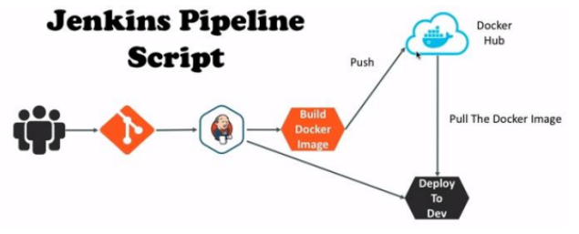
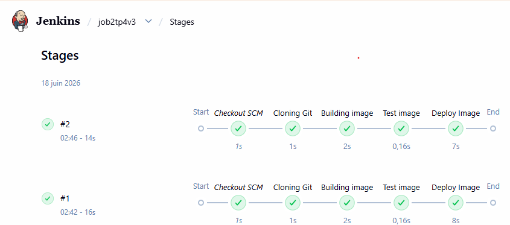
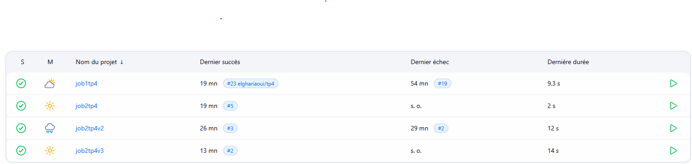

# Test_Project

Projet Java Web minimal (structure `src/main/java` + `src/main/webapp`) pour développement et déploiement.

## Description

Ce dépôt contient une application web Java (fichiers sources Java et ressources web). Le projet est organisé pour être déployé dans un conteneur servlet (Tomcat, Jetty, etc.).

## Structure du projet

- `dockerfile` : image Docker (si présente) pour déployer l'application.
- `Jenkinsfile` : pipeline CI (si utilisée dans votre infrastructure).
- `build/` : classes compilées (artifact intermédiaire).
- `src/main/java/` : code source Java.
- `src/main/webapp/` : ressources web (HTML, WEB-INF, etc.).

## Prérequis

- JDK 11+ (ou version compatible avec votre code).
- Un conteneur servlet (ex. Tomcat) ou Docker pour exécution.
- Outils optionnels : Maven/Gradle si vous choisissez d'ajouter une configuration de build.

## Compilation et empaquetage (méthode générique)

1. Compiler les sources Java (ex. en local) :

```sh
javac -d build/classes $(find src/main/java -name "*.java")
```

2. Créer le WAR en incluant les classes et les fichiers web :

```sh
jar -cvf Test_Project.war -C src/main/webapp . -C build/classes .
```

3. Déployer le WAR dans Tomcat (copier `Test_Project.war` dans `webapps/`).

## Exécution avec Docker

Si un `dockerfile` est présent et configuré :

```sh
docker build -t test_project .
docker run -p 8080:8080 test_project
```

Accédez ensuite à `http://localhost:8080/`.

## Intégration continue

Le `Jenkinsfile` peut être utilisé pour intégrer le build, les tests et le déploiement dans votre chaîne CI.

## Docker (détails pour ce dépôt)

Le projet contient un `dockerfile` simple basé sur Nginx qui copie `src/main/webapp/index.html` dans l'image Nginx. Pour construire et lancer l'image :

```sh
docker build -t test_project .
docker run --rm -p 80:80 test_project
```

Notes :
- Le `dockerfile` expose le port `80` et sert le contenu statique via Nginx.
- Si vous souhaitez empaqueter une application Java (WAR) dans une image, indiquez-le et j'ajouterai un exemple avec Tomcat ou une multi-stage build.

## Intégration continue (Jenkins)

Le dépôt contient un `Jenkinsfile` avec les étapes suivantes : clonage, construction d'image Docker, tests (placeholder) et push vers un registry Docker.

Points importants pour utiliser le `Jenkinsfile` fourni :

- Configurez une `Credential` Docker dans Jenkins (ID indiqué dans le fichier : `dockerhub` ou adaptez-le).
- Le pipeline utilise la variable d'environnement `registry` (par défaut `elghariaoui/tp4`) — adaptez-la à votre compte registry.
- Le stage `Test image` contient actuellement un placeholder ; remplacez-le par vos tests automatisés (ex. tests d'intégration, scan de sécurité).

Exemple de configuration rapide :

1. Dans Jenkins, ajoutez une credential de type "Username with password" nommée `dockerhub`.
2. Paramétrez le job pipeline pour utiliser le `Jenkinsfile` depuis ce dépôt.
3. Lancez le pipeline ; il construira l'image et poussera vers le registry configuré.

## Captures

Voici les captures liées au pipeline Jenkins et au workflow Docker présentes dans ce dépôt. Les images sont stockées dans le dossier `captures/`.

Fichiers d'images disponibles actuellement dans `captures/` :

- `captures/Capture_CI.png` : capture générale CI.
- `captures/Capture_CI_CD.png` : diagramme du workflow CI/CD (GitHub → Jenkins → Docker Hub → déploiement).
- `captures/Capture_CI_CD_Stages.png` : affichage des stages d'un build Jenkins (Checkout, Cloning, Building image, Test image, Deploy Image).
- `captures/Capture_jobs_jenkins.png` : liste des jobs Jenkins (ex. `job1tp4`, `job2tp4`, `job2tp4v2`, `job2tp4v3`).
- `captures/jobs_list.png` : autre capture de la liste des jobs.

Si vous préférez d'autres noms, dites-moi lesquels ; je peux renommer ou remplacer les fichiers.

Remarque : `job1tp4` a été créé pour la CI (build & tests) tandis que les jobs `job2...` servent pour CI/CD (build, test et déploiement automatisé).

### Aperçu des captures








